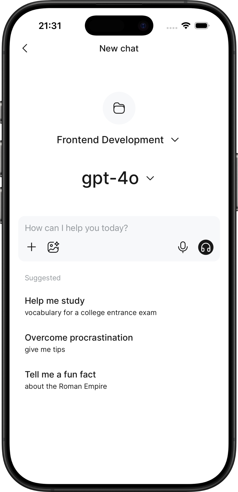
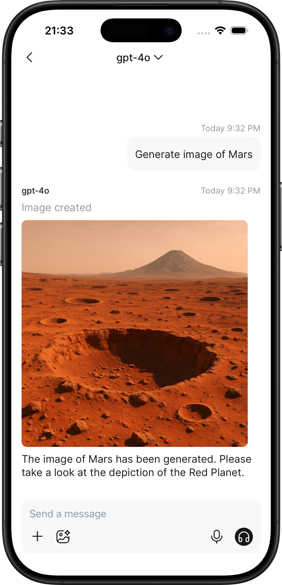
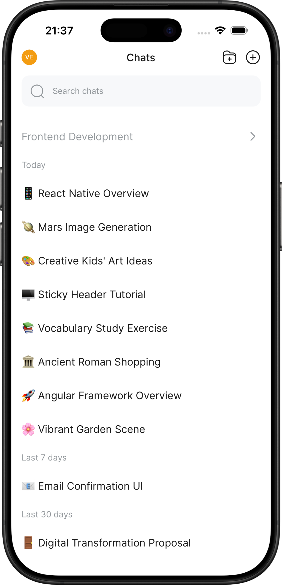

# Open WebUI Mobile App

<div align="center">


**Professional mobile client for Open WebUI** – Access your self-hosted AI assistant anywhere, anytime

[Features](#features) • [Installation](#installation) • [Development](#development) • [Support](#support)

</div>

---

## 📱 Overview

**Open WebUI Mobile App** is a production-ready, cross-platform mobile application that brings the full power of [Open WebUI](https://github.com/open-webui/open-webui) to iOS and Android devices. Built with React Native by [Ronas IT](https://ronasit.com), this app transforms your self-hosted AI assistant into a native mobile experience.

### Why Choose a Native Mobile App?

While Open WebUI works in mobile browsers, this dedicated app provides:

- ⚡ **Optimized Performance** – Native rendering and optimized React Native architecture deliver 60fps smooth interactions
- 🎯 **Mobile-First Design** – UI/UX crafted specifically for touch interactions, gestures, and mobile workflows
- 🔒 **Enhanced Security** – Secure credential storage and enterprise-grade authentication
- 📴 **Offline Capabilities** – Intelligent connection handling and graceful degradation when connectivity is limited
- 💼 **Enterprise Ready** – Built with professional architecture, comprehensive error handling, and maintainable codebase

<div align="center">
  
  &nbsp;&nbsp;&nbsp;&nbsp;&nbsp;
  
  &nbsp;&nbsp;&nbsp;&nbsp;&nbsp;
  
</div>

---

## ✨ Features

### Core Functionality

- ✅ **Open WebUI Compatibility** – Support for all core Open WebUI features
- ✅ **Real-time Chat** – WebSocket-powered instant messaging with your AI assistant
- ✅ **Multi-Model Support** – Switch between different AI models seamlessly
- ✅ **Chat Management** – Organize conversations with folders, search, and archive functionality
- ✅ **Authentication** – Email/password and Google Sign-In support (requires additional setup)
- ✅ **Secure Connections** – Supports encrypted HTTPS/WSS connections to your self-hosted Open WebUI instance (use HTTPS URLs for encrypted communication)

### Mobile-Optimized Experience

- 📱 **Native Performance** – Smooth animations, responsive touch interactions, and optimized rendering
- 🎨 **Modern UI** – Clean, intuitive interface designed for mobile-first workflows
- 🔄 **Smart Sync** – Automatic synchronization with your Open WebUI instance
- 📸 **Media Support** – Image uploads, file attachments, and rich media handling
- 🌙 **Dark Mode** – System-aware theme support for comfortable viewing in any lighting
- ⌨️ **Keyboard Optimization** – Intelligent keyboard handling and input management

### Enterprise Features

- 🏢 **Self-Hosted Ready** – Connect to your private Open WebUI deployment
- 🔐 **Security First** – Secure credential storage, encrypted connections, and privacy-focused architecture
- 📊 **Offline Mode** – Graceful handling of network interruptions
- 🔔 **Real-time Updates** – Live notifications and instant message delivery
- 🌍 **Internationalization** – Multi-language support (coming soon)

---

## 🎯 Use Cases

### For Individuals

- **On-the-Go AI Assistant** – Access your personal AI assistant from anywhere
- **Mobile Productivity** – Get instant answers and assistance without opening a laptop
- **Privacy-Conscious Users** – Keep your conversations private with self-hosted infrastructure

### For Businesses

- **Team Collaboration** – Enable your team to access company AI assistants from mobile devices
- **Field Operations** – Support remote workers and field teams with mobile AI access
- **Cost Efficiency** – Leverage self-hosted infrastructure without per-user mobile app licensing fees
- **Enterprise Security** – Maintain full control over data and conversations with on-premise deployment

### For Developers

- **Open Source Alternative** – Professional-grade mobile client for the Open WebUI ecosystem
- **Reference Implementation** – Well-architected React Native codebase using modern best practices
- **Extensible Platform** – Built with modular architecture for easy customization and extension

## 📥 Installation

### Quick Start

Get started in minutes with pre-built releases or build from source.

### Option 1: Download Pre-built App (Recommended)

#### Android

1. Download the latest `.apk` file from [GitHub Releases](https://github.com/RonasIT/open-webui-react-native/releases)
2. Enable "Install from Unknown Sources" in your Android device settings
3. Install the APK file
4. Launch the app and enter your Open WebUI instance URL

#### iOS

iOS builds are available through TestFlight or App Store (coming soon). Check [Releases](https://github.com/RonasIT/open-webui-react-native/releases) for TestFlight links.

### Option 2: Build from Source

See the [Development](#development) section below for detailed build instructions.

### System Requirements

- **Open WebUI**: active instance with accessible URL
- **Android**: Android 8.0 (API level 26) or higher
- **iOS**: iOS 13 or higher

### First-Time Setup

1. **Launch the App** – Open the installed application
2. **Enter Server URL** – Provide your Open WebUI instance URL (e.g., `https://your-instance.com`)
3. **Authenticate** – Sign in with your Open WebUI credentials (email/password)
4. **Start Chatting** – You're ready to use your AI assistant on mobile!

## 🛠️ Development

### Tech Stack

This project is built with modern, industry-standard technologies:

- **[React Native](https://reactnative.dev/)** – Cross-platform mobile framework
- **[Expo](https://expo.dev/)** – Development platform and build tooling
- **[Nx](https://nx.dev/)** – Monorepo tooling for scalable architecture

### Architecture

The codebase follows a modular, scalable architecture:

- **Monorepo Structure** – Organized with Nx workspaces
- **Feature-Based Modules** – Clear separation of concerns
- **Shared Libraries** – Reusable components and utilities
- **Type Safety** – Full TypeScript coverage

### Building from Source

#### Prerequisites

- **Node.js** 18+ and npm
- **Expo CLI** – `npm install -g expo-cli`
- **EAS CLI** (for builds) – `npm install -g eas-cli`
- **iOS Development**: Xcode 14+ (macOS only)
- **Android Development**: Android Studio with Android SDK

#### Step-by-Step Setup

1. **Clone the Repository**

```bash
git clone https://github.com/RonasIT/open-webui-react-native.git
cd open-webui-react-native
```

2. **Install Dependencies**

```bash
npm install
```

3. **Configure Expo Project**

- Create an account at [expo.dev](https://expo.dev/) if you don't have one
- Create a new project or use an existing one
- Note your project details: `slug`, `owner`, `project ID`

4. **Configure App Settings**

Edit `app.config.js` (or `app.config.ts`) with your project details:

```javascript
{
  name: "Your App Name",
  slug: "your-app-slug",
  owner: "your-expo-username",
  version: "1.0.0"
  // ... additional configuration
}
```

5. **Set Up EAS Build** (Optional, for production builds)

- Create `eas.json` following the [EAS Configuration Guide](https://docs.expo.dev/eas/json/)
- Configure build profiles, app IDs, and credentials

6. **Start Development**

For development builds:

```bash
# Create a development build first (one-time setup)
# Follow: https://docs.expo.dev/develop/development-builds/create-a-build/

# Then start the Metro bundler
npm start
```

For production builds:

```bash
npm run build:prod
```

### Development Resources

- 📖 [Expo Development Builds Guide](https://docs.expo.dev/develop/development-builds/create-a-build/)
- 📦 [EAS Build Documentation](https://docs.expo.dev/build/setup/)
- ⚙️ [Expo Configuration Reference](https://docs.expo.dev/workflow/configuration/)
- 🏗️ [Nx Documentation](https://nx.dev/getting-started/intro)

## 🤝 Contributing

We welcome and appreciate contributions from the community! Whether you're fixing bugs, adding features, or improving documentation, your help makes this project better.

### How to Contribute

1. **Fork the Repository** – Create your own fork of the project
2. **Create a Branch** – Make your changes in a feature branch
3. **Follow Guidelines** – Adhere to our code style and commit conventions
4. **Test Your Changes** – Ensure your changes work correctly
5. **Submit a Pull Request** – Open a PR with a clear description of your changes

### Contribution Areas

- 🐛 **Bug Fixes** – Help us squash bugs and improve stability
- ✨ **New Features** – Propose and implement new functionality
- 📝 **Documentation** – Improve docs, add examples, or fix typos
- 🎨 **UI/UX Improvements** – Enhance the user experience
- ⚡ **Performance** – Optimize code and improve app performance
- 🌍 **Internationalization** – Add translations for new languages

### Getting Help

- 📋 **Report Issues** – Use [GitHub Issues](https://github.com/RonasIT/open-webui-react-native/issues) for bug reports
- 💬 **Discussions** – Join [Open WebUI Discussions](https://github.com/open-webui/open-webui/discussions) for questions
- 📧 **Contact** – Reach out to [Ronas IT](https://ronasit.com) for enterprise support

---

## 🔗 Related Projects

- **[Open WebUI](https://github.com/open-webui/open-webui)** – The main Open WebUI project
- **[Open WebUI Documentation](https://docs.openwebui.com/)** – Official documentation and guides

---

## 💬 Support

### Community Support

- 📚 **Documentation**: Check this README and project docs
- 🐛 **Bug Reports**: [GitHub Issues](https://github.com/RonasIT/open-webui-react-native/issues)
- 💬 **Open WebUI Community**: [Open WebUI Discussions](https://github.com/open-webui/open-webui/discussions)

### Enterprise Support

For businesses requiring professional support, custom development, or enterprise features:

- 🌐 **Website**: [Ronas IT](https://ronasit.com)
- 📧 **Contact**: Reach out through our website for enterprise inquiries
- 🏢 **Services**: Custom mobile development, consulting, and dedicated support

### Frequently Asked Questions

**Q: Is this app free to use?**
A: Yes! This is an open-source project released under the GNU General Public License v3 (GPL v3). You are free to use, modify, and distribute it under the terms of the GPL v3.

**Q: Do I need to host my own Open WebUI instance?**
A: Yes, this app connects to your self-hosted Open WebUI deployment. See [Open WebUI Installation](https://docs.openwebui.com/) for setup instructions.

**Q: Is my data secure?**
A: Absolutely. All connections are encrypted, and your data stays on your self-hosted instance. The app never stores or transmits your conversations to third parties.

**Q: Can I use this for commercial purposes?**
A: Yes, GPL v3 allows commercial use. However, if you distribute the software (or modified versions), you must also provide the source code and license your modifications under GPL v3. See the [LICENSE](LICENSE.txt) file for complete terms.

**Q: How do I report a security vulnerability?**
A: Please email security concerns directly to our team through [Ronas IT](https://ronasit.com) rather than opening a public issue.

---

## 📄 License

This project is licensed under the **GNU General Public License v3 (GPL v3)**.

**Note**: If you need to use this code in a proprietary application without GPL v3 obligations, please contact [Ronas IT](https://ronasit.com) to discuss alternative licensing options.

---

## 🙏 Acknowledgments

- **Open WebUI Team** – For creating an amazing open-source AI interface platform
- **React Native Community** – For the excellent framework and ecosystem
- **All Contributors** – Thanks to everyone who helps improve this project

---

<div align="center">

**Built with ❤️ by [Ronas IT](https://ronasit.com)**

_Professional mobile development services • Open source contributors_

[Website](https://ronasit.com) • [GitHub](https://github.com/RonasIT) • [Email](mailto:hello@ronasit.com)

</div>
